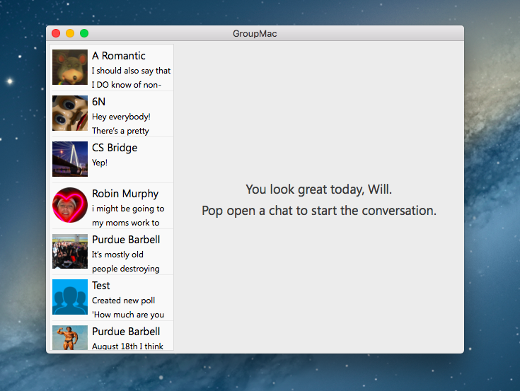
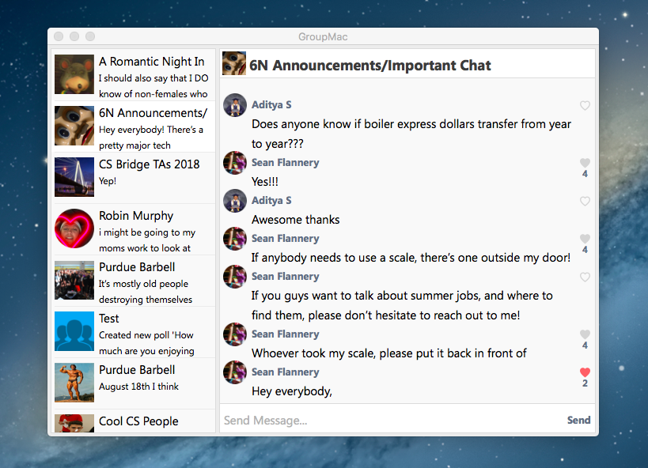

## GroupMac
A GroupMe client built natively in Swift for the macOS platforms.

GroupMac uses the public GroupMe API to provide the features, functionality, and look and feel that the iOS GroupMe app and GroupMe website provide (<https://groupme.com/>). Information and documentation pertaining to the public GroupMe API can be found at <https://dev.groupme.com/>.

## Developer Token
To develop this app, you will need your GroupMe API access token. To get your access token, visit [dev.groupme.com](https://dev.groupme.com/), login, and look for the access token link in the top-right corner. Once you've gotten your token, create a file, "token.txt", paste your token on a single line in the file, and place the file in the GroupMe folder in this project directory.

## Features
So far the app has implemented the following:

#### App
* Display a welcome message to the user before a conversation has been selected.
	* Use their first name in the message.
* Built using the programatic approach. Contains zero Storyboard files.

#### Conversations
* Display conversations on the left, sorted by when the chat was last updated.
	* Highlight conversations on mouse-hover.
	* Change item color upon being selected.
* Upon selection of a conversation, display a conversation header, conversation transcript, and send message box.
	* Display the group's profile image in addition to the title of the group in the header.
	* Display the most recent messages belonging to the conversation in an NSCollectionView.

#### Messages
* Display a heart button and label to the right-side of the message to indicate the amount of likes a message has and whether the user has liked the message.
	* Highlight heart button on hover.
	* Change color of heart button to indicate that the message has been liked at all.
	* Disable likes-count label if the amount is zero.
* Display the profile image of the message sender to the left.
* Display any text belonging to the message.
* Display any attached images (Even this is a little buggy. Could use some work.)

## Room For Improvement
This app still has a long way to go. Some features that should be implemented eventually are:

#### App
* A login page for new users.
* Push notifications and live updates.

#### Conversations
* Display all conversations, not just the recent ones.
* Configure the messages collection view to layout the items from bottom to top.
* Infinite scrolling of the conversation transcript.
* Ability to view members belonging to a group.
* Display times in conversation transcript where appropriate.

#### Messages
* Full attachment support.

## Preview

